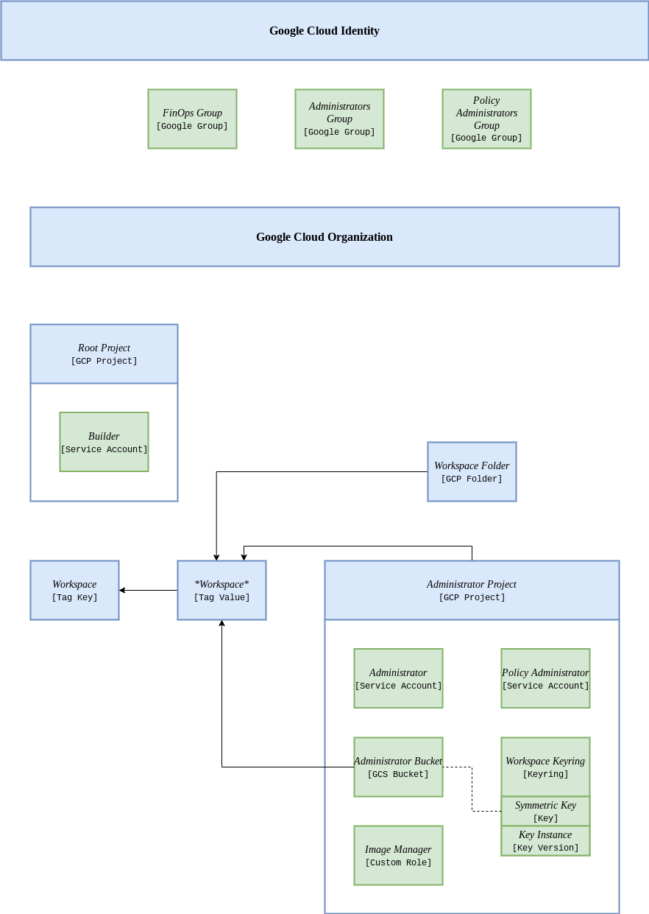

<!-- BEGIN_TF_DOCS -->
# Root

This module sets up the root structure in a Google Cloud organization.

## Infrastructure description

The code creates a root folder as well as a root Google Cloud project, hosting several critical service accounts for the organization.

The **project creator** service account can create any project inside the root folder.

The **org policy** service account can apply any policy at the organization level.

## Organization description

The root structure attemps to create a sub-organization inside the Google Cloud Platform.

Security is then preserved since the original organization is never used apart for creating the root structure.

Below is a simple diagram presenting the structure:


*Figure - Organization diagram for the root structure.*

### Cloud identity

Users and groups

### Cloud organization

IAM and resources

### Root project

Service accounts

### Root folder

Workspaces

## Usage

Before running this code, you should first create a Google Cloud Platform **organization** (see official documentation).

You should also have set up a valid **Billing account** for your organization.

Set the values of the required variables in terraform.tfvars (specifically billing account ID and organization name).

This code should be used against with **application-default** credentials of an **Organization Administrator**.

In order to login with application-default, type:
```bash
gcloud auth application-default login
```
You will be redirected to a web login interface.

The organization administrator should also claim billing account usage.

Once you are authenticated with application-default credentials, you can run the script:
```bash
./run.sh
```

The root structure is then created.

## Requirements

| Name | Version |
|------|---------|
| terraform | ~> 1.1.2 |
| google | ~> 4.5.0 |
| random | ~> 3.1.0 |

## Modules

| Name | Source | Version |
|------|--------|---------|
| service\_account | ./modules/service account | n/a |

## Resources

| Name | Type |
|------|------|
| [google_cloud_identity_group_membership.workspace_group_owner](https://registry.terraform.io/providers/hashicorp/google/latest/docs/resources/cloud_identity_group_membership) | resource |
| [google_compute_firewall.firewall](https://registry.terraform.io/providers/hashicorp/google/latest/docs/resources/compute_firewall) | resource |
| [google_compute_network.network](https://registry.terraform.io/providers/hashicorp/google/latest/docs/resources/compute_network) | resource |
| [google_compute_route.default_route](https://registry.terraform.io/providers/hashicorp/google/latest/docs/resources/compute_route) | resource |
| [google_compute_subnetwork.subnetwork](https://registry.terraform.io/providers/hashicorp/google/latest/docs/resources/compute_subnetwork) | resource |
| [google_folder.root_folder](https://registry.terraform.io/providers/hashicorp/google/latest/docs/resources/folder) | resource |
| [google_folder_iam_member.root_folder_admins](https://registry.terraform.io/providers/hashicorp/google/latest/docs/resources/folder_iam_member) | resource |
| [google_folder_iam_member.root_folder_project_creator](https://registry.terraform.io/providers/hashicorp/google/latest/docs/resources/folder_iam_member) | resource |
| [google_project.root_project](https://registry.terraform.io/providers/hashicorp/google/latest/docs/resources/project) | resource |
| [google_project_iam_binding.no_editors](https://registry.terraform.io/providers/hashicorp/google/latest/docs/resources/project_iam_binding) | resource |
| [google_project_iam_binding.no_owners](https://registry.terraform.io/providers/hashicorp/google/latest/docs/resources/project_iam_binding) | resource |
| [google_project_service.service](https://registry.terraform.io/providers/hashicorp/google/latest/docs/resources/project_service) | resource |
| [random_string.random](https://registry.terraform.io/providers/hashicorp/random/latest/docs/resources/string) | resource |
| [google_organization.org](https://registry.terraform.io/providers/hashicorp/google/latest/docs/data-sources/organization) | data source |

## Inputs

| Name | Description | Type | Default |
|------|-------------|------|---------|
| billing\_account | The ID of the billing account used for the workspace. | `string` | n/a |
| organization | Name of the organization hosting the workspace. | `string` | n/a |
| region | Geographical *region* for Google Cloud Platform. | `string` | n/a |
| service\_accounts | List of service accounts along with their privileges. Only underscore, digits and lowercase letters are allowed for the key. | ```map(object({ description = string roles = list(string) }))``` | n/a |

## Outputs

| Name | Description |
|------|-------------|
| root\_project\_id | ID of the root project |
<!-- END_TF_DOCS -->